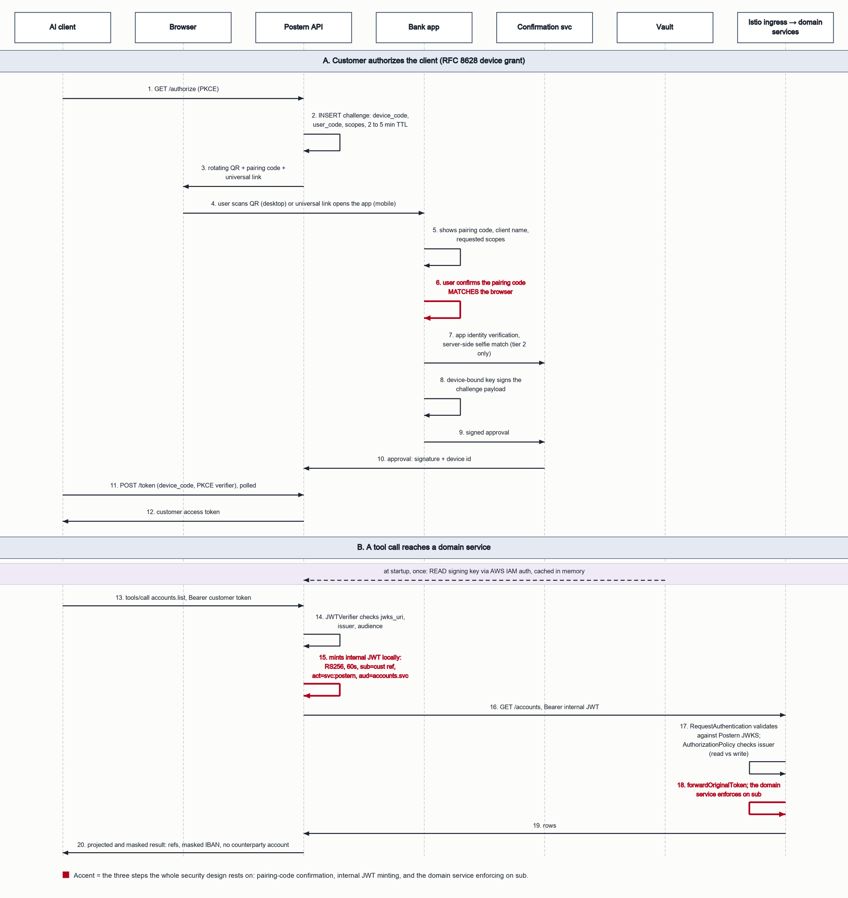

<p align="center">
  
</p>

# Postern

> **Zero-trust MCP server that exposes an operator's backend services to AI clients
> as tools — with authentication, per-session anomaly detection, tiered verification,
> and fail-closed auditing.**

[](https://www.python.org/downloads/)
[](https://opensource.org/licenses/MIT)
[](https://modelcontextprotocol.io/)
[](Makefile)

## What Postern is

[MCP](https://modelcontextprotocol.io/) gives AI models tools, but it was built for
a **local, trusted transport** (stdio on a single machine). Postern keeps MCP's tool
model exactly as-is and wraps it in a **zero-trust security layer** so the same tools
work safely across machines:

- **Authentication** — RFC 8628 device grant (QR pairing codes), JWT sessions,
  RS256 asymmetric tokens for multi-party deployments
- **Per-session anomaly detection** — record budgets, account diversity
  limits, session age caps; MEDIUM signals escalate verification tier, HIGH signals
  hard-fail the call and end the session
- **Three-tier verification** — `SESSION_ONLY` (reads) → `APP_APPROVAL`
  (device-bound key + PIN/biometric) → `APP_IDENTITY_VERIFICATION` (tier 1 plus
  server-side selfie matching with liveness)
- **Fail-closed auditing** — every tool call writes two rows (entry before backend
  touch, completion after); a failed audit write fails the call
- **Key split architecture** — read and write keys are completely separate,
  published on different JWKS endpoints; a compromised tool handler cannot mint a
  token the payments service will accept
- **PAN/IBAN masking** — multi-layer redaction (invisible character stripping,
  lookalike codepoint mapping, script intrusion bridging, checksum validation) with
  a bounded scan budget of 100,000 checksum operations per call
- **Consent enforcement** — per-tool authorization via Postgres-backed consent
  table; filtering `tools/list` alone leaves hidden tools callable by name, so every
  call is checked

> **Status:** Postern inverts nearly all public Open Banking prior art. A survey of 24
> public "open banking mcp server" repos in September 2026 found the read-only surface
> crowded, the write surface essentially unbuilt, and nothing at all for the operator-internal
> first-party case. Five read tools are registered: `start_session`, `accounts.list`,
> `accounts.get_balance`, `transactions.list` and `cards.list`. Every one but
> `start_session` is gated by a Postgres-backed consent check.

## Key Features

### Authentication & Authorization

- **RFC 8628 Device Grant** — QR pairing codes, user-visible verification codes
  (XXX-XXX format), anti-phishing matching on both surfaces before identity verification proceeds
- **JWT sessions** — HS256 for single-trust-domain, RS256 asymmetric for federated
  deployments (one issuer mints tokens, peers verify-only)
- **Per-tool consent** — `consent_for(domain, db)` returns an `AuthCheck` that filters
  the tool catalogue and refuses calls; refusal reasons are recorded in the audit log

### Zero-Trust Controls

Continuous authorization, workload attestation, key split architecture, per-session
anomaly detection, fail-closed auditing, and data masking. See the [Zero Trust overview](docs/zero-trust.md)
for details on each control and what is still pending.

### Audit & Compliance

- **Two-row audit pattern** — entry row (`outcome='reaching'`) committed before backend
  touch, completion row (`returned`/`raised`) after; paired by `call_id`
- **Database CHECK constraints** — closed vocabularies for `refusal_reason`, `outcome`,
  `customer_ref_absence_reason` enforced at the database level, not just in application code
- **XOR invariant** — every audit row has either a `customer_ref` OR an
  `absence_reason`, never both or neither (`ck_audit_log_customer_ref_xor_absence`)
- **Fail-closed writes** — audit write failures block the call rather than allowing
  unrecorded data access

### Data Protection

- **PAN/IBAN masking** — 5-layer redaction pipeline: invisible character stripping,
  lookalike codepoint mapping, script intrusion bridging, IBAN checksum validation,
  PAN unbounded digit scanning. Residual gaps documented in ADR-0008.
- **CustomerRef validation** — pattern `^cust[:_][A-Za-z0-9]{1,60}$` rejects IBAN/PAN/national ID shapes at the identity layer
- **Field-by-field projection** — `build_model` wrapper catches pydantic validation errors and re-raises as `BackendError(502, ...)`, preventing raw value leakage

## Architecture

Two deployables share one library:

```
packages/postern-core/     shared library: domain types, façade, identity, masking
services/api/              read path — MCP tools, OAuth endpoints, consent checks
services/confirm/          write path — approval callback, payment execution, device auth
```

A compromised tool handler cannot mint a token the payments service will accept, because
it does not hold the key. That is an infrastructure property, not a code-review promise.

### Flow

The diagram below covers both phases end to end. Phase A is the RFC 8628 device
grant: the customer scans a rotating QR or opens a universal link, confirms a
pairing code in their own bank app, and the signed approval becomes a customer
access token. Phase B is a single tool call: Postern verifies the customer token,
mints a short-lived internal JWT from a Vault-cached signing key, and Istio
enforces that internal JWT before a domain service returns rows that Postern
projects and masks back to the client.



## Quick Start

```bash
uv sync
make ci          # lint, fmt-check, type, imports, lock, citations, test
```

`make fmt` formats. Note that `fmt-check` is scoped to `packages services tests`
rather than `.`, because `ruff format` on `.` also rewrites the Python code fences
inside the markdown design docs.

## Documentation

### User Guide (new)

Structured documentation with setup instructions, component manuals, and glossary:

- [**Getting Started**](docs/user-guide/getting-started.md) — Prerequisites, installation, configuration
- [**API Service**](docs/user-guide/components/api-service.md) — Read path: MCP tools, OAuth endpoints
- [**Confirm Service**](docs/user-guide/components/confirm-service.md) — Write path: device auth, approvals
- [**Risk Engine**](docs/user-guide/components/risk-engine.md) — Anomaly detection, tier escalation
- [**Session Store**](docs/user-guide/components/session-store.md) — In-memory and Redis backends
- [**Masking**](docs/user-guide/components/masking.md) — PAN/IBAN redaction layers
- [**Audit System**](docs/user-guide/components/audit.md) — Two-row pattern, fail-closed writes
- [**Glossary**](docs/user-guide/glossary.md) — Key terms and concepts

## Running the gates

```bash
uv sync
make ci
```

`make ci` runs: `lint`, `fmt-check`, `type`, `imports`, `lock`, `citations`, `test`.
They run locally because GitHub Actions minutes are billed on private repos. A workflow
file is installed with `on: workflow_dispatch` only, so nothing fires on push until
someone decides to spend the minutes.

## Stack

Python 3.12 (pinned in `.python-version`), fastmcp 4.0.3, pydantic 2.13.5,
httpx2 2.12.0, SQLAlchemy 2.0 async, Alembic, uv.

Two version traps will produce plausible and wrong code from memory:

1. **FastMCP is v4, under `PrefectHQ`, not `jlowin`.** Almost every FastMCP example
   in training data and on the web is v2 or v3. Docs are published in llms.txt form
   at https://gofastmcp.com/llms.txt.
2. **MCP `2026-07-28` removed the `initialize` handshake and protocol-level
   sessions**, including `Mcp-Session-Id`. Every request is self-describing, so
   there is no in-process session state anywhere.

The HTTP client is `httpx2`, not `httpx`, because that is what FastMCP 4 depends on.
`respx` cannot mock it: it type-checks against `httpx.Response` and raises
`TypeError` at mock-setup time. Backend tests inject an `httpx2.MockTransport`
instead. See [ADR-0001](dev-docs/decisions/0001-facade-http-client.md).

## Critical path note

**Domain service scoping is the critical path and it is not answered in this repo.**
Istio validates the JWT; the operator's domain services must enforce on it. If any
handler scopes its query by an account ID taken from the request body rather than by
the token `sub`, the whole authorization layer is decorative and cross-customer access
is live.
