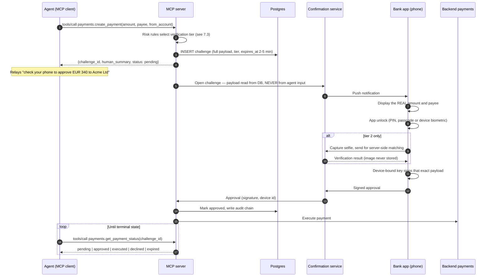
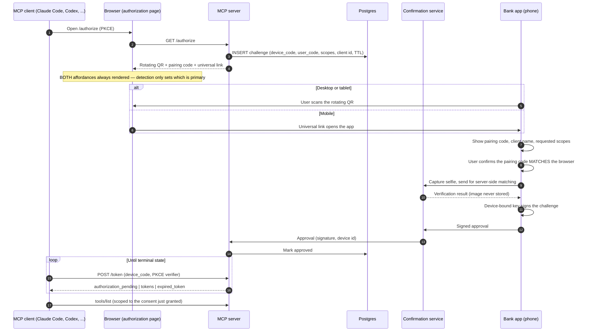

# Bank MCP Server — Design Handoff

**Purpose:** This document carries the design decisions from a planning conversation into an implementation session. It is written for a Claude Code session that has access to the actual codebase, AWS accounts, and internal service contracts.

**Status:** Design agreed at architecture level. No code written. Several decisions are still open and are listed explicitly in §10.

---

## 0. Read this first (instructions for the Claude Code session)

Before writing any code, do these six things in order:

1. **Verify the MCP protocol version.** The protocol changed substantially in the `2026-07-28` revision, which removed the `initialize`/`initialized` handshake and protocol-level sessions. This document was written with partial knowledge of that revision. Fetch the current spec before designing the wire layer:
   - Sitemap: `https://modelcontextprotocol.io/sitemap.xml`
   - Spec: `https://modelcontextprotocol.io/specification/2026-07-28`
   - Changelog: `https://modelcontextprotocol.io/specification/2026-07-28/changelog`
   - Fetch pages with a `.md` suffix for markdown.
   Confirm in particular: where server-level `instructions` now live (the field was attached to `InitializeResult`, which no longer exists), the exact `server/discover` response shape, and the current state of DCR-vs-CIMD for authorization.

2. **Read the `mcp-builder` skill** if available in your environment. It covers tool naming, input/output schemas, annotations, error message design, and evaluation harnesses.

3. **Do not assume anything in §2 (context) is still true.** It came from conversation, not from the codebase. Verify against the actual AWS accounts and service contracts.

4. **Answer the open questions in §10 with the user before implementing.** Several of them change the architecture, not just the code.

5. **Read `bank-mcp-python-implementation-guide.md`** for framework specifics, repo layout, and code patterns. **Its §0 verification protocol is mandatory** — FastMCP is at v4 (PrefectHQ org, not jlowin), and almost every FastMCP example in training data and on the web is v2 or v3. Do not reconstruct API shapes from memory.

6. **Read the companion document `bank-mcp-zero-trust-plan.md`.** It carries the threat model, the zero-trust gap analysis, and the security work items. **ZT-2 in that document (do the backend domain services enforce on the JWT `sub`?) is on the critical path** — if they do not, the whole authorization layer is decorative, and finding that out six weeks in would be the worst available outcome. Answer it in week one.

**Terminology trap — read before writing code:** the bank app's identity-verification feature is branded "Face ID" internally, but it is **server-side selfie matching running in the backend cluster**, not Apple's on-device Face ID. Never use the term "Face ID" in this codebase. See §7.4.

**Things in this document that are decisions, not suggestions:** the tool surface must not contain a payment execution tool (§6.2); consent state and eIDAS keys live in the MCP account only (§5); the confirmation payload is built server-side from stored state, never from agent input (§6.3).

---

## 1. What is being built

An MCP server that exposes a bank's capabilities to AI agents (Claude and others) as tools, organised by banking domain, covering both read and write operations, with tool contracts shaped to match Open Banking API semantics.

**Confirmed scope (answered by Stefano):**

- **Consumers: external third-party agents.** Not internal-only. Internet-facing edge, public OAuth callback, client registration gate, per-client rate limiting.
- **Backend: the org's own services only.** The server does NOT act as a TPP consuming other banks' Open Banking APIs. No multi-ASPSP adapter layer (§8 collapses).
- **Domains in v1: accounts, transactions, cards, payments** — all four. See §11 for why payments should still land last *within* v1.

**We are the ASPSP, not the TPP.** This inverts the usual Open Banking posture and much of the public prior art (§14), where every project is a third party reading accounts via an aggregator. Here the bank services the accounts and external agents consume. Tool contracts are still modelled on Open Banking semantics for familiarity and future portability, but the eIDAS direction reverses — see §7.1.

**Who the "third parties" are: consumer AI clients, not licensed TPPs.** The customers are the bank's own; the third party is the *client software* (Claude, ChatGPT, Perplexity). The customer authenticates directly with us via the QR flow (§7.3) and reaches only their own accounts. The AI vendor is a software supplier, comparable to a browser — not a payment institution.

**Working assumption: this is our own direct channel, NOT a PSD2 dedicated interface.** That means no inbound TPP certificate verification, no testing facility, no published availability statistics, no fallback mechanism. **Confirm with compliance (§10.2)** — the regulatory treatment of consumer AI agents against bank APIs is not settled, and if it were ever judged a dedicated interface the obligation set is a programme, not a feature.

**What follows from external consumer clients:**

- **We control nothing about rendering.** No say in the system prompt, the UI, or whether a model paraphrases a balance wrongly. Mitigate in the tool layer: structured amounts with explicit currency and `as_of`, account identifier alongside every balance, strict `outputSchema` (§6.5).
- **Customer data lands in third-party chat histories** under their retention policies, unrecallable by the bank. Minimization is the control (§6.5).
- **Allowlist clients.** With CIMD anyone with a metadata document can present themselves. Start with a known set, each with its own client ID, rate limits, and kill switch.
- **Design for the weakest client, not for Claude.** MCP feature support varies across vendors and some will lag the `2026-07-28` revision. This makes the bootstrap tool (§4.2) load-bearing: it is the only context-delivery mechanism that works everywhere, because it arrives as a tool result. Depend on neither `resources` being read nor MRTR being supported.
- **Attended access, so no four-poll cap.** PSD2's four-polls-per-day limit applies to *unattended* access. Users are present in the conversation.

---

## 2. Environment context (verify this)

From conversation, not verified against infrastructure:

- AWS, multi-account. A dedicated VPC for the MCP workload; backend services run in a separate account/VPC.
- Fargate is the intended compute for the MCP server.
- Backend cluster reachable cross-account. Connectivity options discussed: PrivateLink (recommended) or Transit Gateway (acceptable if a hub already exists).
- An existing backend service handles app-based authentication and operation confirmation. The app is a standard secure banking app (PIN, passcode, device biometrics). Its identity-verification feature is branded "Face ID" internally but is **server-side selfie matching in the backend cluster, not Apple Face ID** — see §7.4, this distinction matters. **This service is the single most important existing asset: the entire write path is built on it.**
- Domain services exist for cards, payments, transactions (and presumably accounts).

**Delivery (confirmed):** application code in a GitHub repo (Python, Docker image); **infrastructure in a separate Terraform repo**; running on **Fargate**; minimal image. See §12.

**Verify:** whether a TGW hub already exists and the MCP VPC can attach; whether the confirmation service supports headless/server-initiated challenges or assumes a web redirect; whether the backend has an internal ALB or only per-service NLBs; CIDR allocations.

---

## 3. Protocol layer

### 3.1 Transport

Streamable HTTP. Not stdio — stdio is single-user local and cannot hold multi-tenant credentials or eIDAS keys.

### 3.2 Statelessness

Under the `2026-07-28` revision this is the protocol default: protocol-level sessions and the `Mcp-Session-Id` header are removed, and every request is self-describing. Any request can land on any instance behind a plain load balancer.

**Implication for us:** no in-process session state at all. Where state must persist across calls, mint an explicit handle from a tool call and have the model pass it back as an ordinary argument. This is exactly the pattern the payment flow uses (a challenge ID), so it fits naturally.

### 3.3 Header-based routing

Requests carry `Mcp-Method` and `Mcp-Name` headers, so the ALB/WAF can route, rate-limit, and authorize per tool name without parsing the JSON body.

**Use this.** Apply stricter edge policy to `payments.*` than to `transactions.*`.

**Security requirement, non-negotiable:** the server MUST validate that the headers match the body and reject mismatches with `400` and JSON-RPC error `-32020`. A load balancer routing on a header while the server executes on the body is a request-smuggling shape. Implement this check in middleware before any handler runs, and write a test for it.

### 3.4 Cacheable list results

`tools/list`, `prompts/list`, `resources/list`, `resources/read` carry `ttlMs` and `cacheScope`.

**Set `cacheScope` per-user, never global.** The tool catalog varies by consent state; a shared cache would leak which accounts and permissions a user has. Get this wrong and it is a data leak, not a performance bug.

### 3.5 MRTR (Multi Round-Trip Requests)

Replaces server-initiated elicitation. The server returns `resultType: "input_required"` with the requests it needs answered; the client retries the original call with answers in `inputResponses`.

**Use it for:** disambiguation — which account to pay from, which card, date range clarification.

**Do NOT use it for:** authorizing money movement. MRTR routes the answer back through the model's channel. Money movement is authorized out-of-band on the user's device (§6.3).

---

## 4. Advertising context to the model

The question this answers: when Claude connects, how does it learn what this server is for and how to use it?

Three mechanisms, used together:

### 4.1 Server-level instructions

The `instructions` string describes the server and its features and is intended to be added to the model's system prompt. Historically it lived on the initialize result; **confirm where it lives now** (likely `server/discover`).

Caveat that drives the design below: client support has been inconsistent. Claude Code processes server instructions; claude.ai has been observed to ignore the field, and truncates tool descriptions around 500 characters.

### 4.2 A bootstrap tool (required — do not skip)

Expose a tool such as `banking_start_session` that the instructions and every tool description point to as the required first call. It returns:

- The user's available accounts and their identifiers
- Current consent status per domain (which reads are authorized, which writes are enabled, consent expiry dates)
- The operating rules: how to reference accounts, currency/amount formats, pagination conventions, what the confirmation flow looks like and what to tell the user during it
- Which tools are currently callable given consent state

This guarantees the guidance arrives regardless of client behaviour, and it is personalized rather than static — which for a banking server is more useful than a fixed instruction blob anyway.

### 4.3 Tool descriptions

Assume ~500 characters usable. Keep them tight. Put cross-cutting workflow guidance in the bootstrap tool result, not repeated per tool.

### 4.4 Resources and prompts

- **Resources** for reference material: error code glossary, supported payment schemes, currency list, category taxonomy for transaction enrichment. Resources are app-controlled — the client decides whether to read them, so never make correctness depend on one being read.
- **Prompts** for user-invocable workflows: "review my spending this month", "prepare a payment".

---

## 5. Deployment architecture

```
                        AI agent (HTTPS)
                               |
  ┌────────────────────────────┼────────────────────────────┐
  │ MCP ACCOUNT VPC            │                            │
  │                            v                            │
  │  Public subnet: ALB + WAF (TLS term, per-tool policy)    │
  │  Public subnet: NAT Gateway + Elastic IP (egress)        │
  │  Private subnet: Fargate service (stateless MCP tasks)   │
  │  Private subnet: RDS Postgres (consents, tokens, audit)  │
  │  Secrets Manager: QWAC + QSEAL keys (KMS CMK)            │
  └──────────┬─────────────────────────────┬─────────────────┘
             │ PrivateLink                 │ NAT egress, mTLS
             v                             v
  ┌──────────────────────┐      ┌──────────────────────────┐
  │ BACKEND ACCOUNT VPC  │      │ External bank ASPSP APIs │
  │  NLB → internal ALB  │      │  (only if acting as TPP) │
  │  → cards, payments,  │      └──────────────────────────┘
  │    transactions,     │
  │    accounts,         │
  │    confirmation svc  │
  └──────────────────────┘
```

### 5.1 Why PrivateLink over Transit Gateway

Both were considered. PrivateLink is the recommendation:

- The MCP server is an LLM-driven tool-calling surface. A prompt injection that reaches it can attempt any tool call the server is capable of making. Minimising what is *reachable at the network layer* matters more here than for a conventional service.
- "There is no route to anything but these APIs" is a stronger control and far easier to evidence to an auditor than "the route exists but security groups deny it."
- PrivateLink's unidirectionality is not a problem for us, because tool definitions are static config (§6.1), not runtime registration.

Choose TGW instead only if: an org-standard hub already exists and the network team requires it, or you need bidirectional reachability for a reason not anticipated here. If TGW: dedicated route table for the MCP attachment propagating only the backend VPC, plus SG-level restriction to the MCP task SG.

### 5.2 PrivateLink specifics

- **One** endpoint service, not one per domain. Backend account runs an NLB fronting an internal ALB that path-routes to the domain services. Four endpoint services would multiply DNS names, SG rules, and cost for no benefit.
- TLS passthrough at the NLB so tool calls stay encrypted across the account boundary.
- Enable private DNS so application code targets a stable hostname, not the generated `vpce-*` name.
- Scope allowed principals to the MCP task role, not the whole account.
- Decide auto-accept vs manual connection acceptance with the network team.

### 5.3 Egress

PrivateLink does nothing for outbound ASPSP calls — those go to the public internet over mTLS. NAT Gateway with an Elastic IP, one per AZ. This is the IP that ASPSPs whitelist alongside the QWAC check, so it must be pinned. **This is the largest fixed cost in the stack** (~€35/month per NAT Gateway plus data processing). PrivateLink by comparison is ~$0.01/hour per endpoint per AZ plus ~$0.01/GB.

### 5.4 Trust boundary

The MCP account **is** the TPP/compliance boundary. Everything sensitive lives there and nowhere else:

- eIDAS certificates (QWAC for transport mTLS, QSEAL for payload signing) in Secrets Manager, KMS-encrypted, pulled at task start, never baked into the image, never in the repo
- Consent records, OAuth refresh tokens, audit log in RDS in the MCP VPC
- Task role scoped to exactly those secrets

Do not put consent state in the backend cluster. That smears the compliance boundary across two accounts and makes the audit story much harder to evidence.

### 5.5 Region

EU region (`eu-central-1` or `eu-west-1`) if handling EU account data. Some ASPSP agreements require it explicitly, and the audit log is personal financial data under GDPR regardless.

---

## 6. Tool design

### 6.1 Structure

One MCP server, domain-namespaced tools: `accounts.*`, `cards.*`, `payments.*`, `transactions.*`.

Tool definitions are **static config versioned in the repo**, deployed with the server. Not registered at runtime by backend services. Runtime registration would require reverse connectivity (breaking the PrivateLink design), makes the tool surface non-reviewable, and makes it impossible to diff what changed between deploys — which for a money-moving surface is unacceptable.

Scope visible tools per session by consent state. If a session has no payment consent, the payment tools should not appear in `tools/list` at all.

### 6.2 Read vs write

Use annotations honestly: `readOnlyHint`, `destructiveHint`, `idempotentHint`, `openWorldHint`. These are hints to the client, **not enforcement** — enforce server-side regardless.

**Hard rule: there is no payment execution tool.** Expose `payments.create_payment` and `payments.get_payment_status`. Execution is triggered by the biometric confirmation, server-side. If a `submit_payment` tool exists in the schema, the model holds an execution capability and you are relying on it not to use it. Remove the capability instead — then the worst a compromised or injected agent can do is generate a push notification the user declines.

**Execution belongs to the server, never the agent.** After a confirmation arrives, the *approval callback handler* calls the backend write endpoint — not the tool handler, and not the agent. The agent only polls and observes a status change. If the agent could execute once approval landed, an injected agent could get one thing approved and execute another, breaking the binding between what the user saw and what ran. Enforce this structurally: the tool-handler execution context should not hold the credentials or the network permission to reach backend write endpoints at all.

**The token is the identity.** Never accept `user_id` as a tool argument, and never hand it to the client as a separate value. The server derives the user from the token on every call. A user identifier the model can set is a direct object reference an agent can be talked into changing.

### 6.3 The write confirmation flow

This is the core security design. The existing app confirmation service is what makes it work. Terminology warning: the app's "Face ID" is server-side selfie matching, not Apple Face ID (§7.4).



Step 6 is the one that makes injection at step 1 survivable: the push payload is generated server-side from the stored challenge row. A compromised agent can propose a wrong payee, but it cannot change what the user is shown.

Properties that must hold:

- **The approval never travels through the model's channel.** An injection can make the model propose a payment to the wrong payee, but the user sees the real amount and beneficiary on their own device before biometrics unlock anything.
- **Dynamic linking (PSD2 RTS Art. 5).** The authentication code must be cryptographically bound to the specific amount and payee; any change invalidates it. The confirmation service presumably already does this — the rule for us is that the payload sent to the phone is generated **server-side from the stored challenge record**, never re-sent or re-specified by the agent. The stored challenge is the source of truth for what executes.
- **Non-blocking.** `create_payment` returns immediately with the challenge ID and a human-readable summary the agent relays ("check your phone to approve €340 to Acme Ltd"). Never block a tool call waiting for confirmation — client timeouts plus a burned connection for two minutes.
- **Expiry.** Challenges expire at 2–5 minutes. Return a clear `expired` status so the model offers a retry rather than hanging.
- **Idempotency.** The challenge ID is the idempotency key. `create_payment` called again with identical parameters inside a short window returns the existing pending challenge, never opens a second one. An agent retrying on timeout must not be able to double-charge.

### 6.4 Same flow for consent

Initial AIS (account information) consent authorization needs SCA too, and re-authentication at least every 180 days under the RTS. Route it through the same push-and-biometric flow so users get one consistent confirmation experience for both read authorization and payment approval.

### 6.5 Data masking and minimization

**Why this is a primary control, not hygiene.** Consumers are external AI clients (Claude, ChatGPT, Perplexity — §1). Tool results land in those vendors' chat histories, under their retention policies, and **the bank cannot recall them**. There is no MCP "do not persist" flag, and a note in a tool description is a prompt, not a control. Ephemeral/incognito modes are user settings we cannot require, detect, or verify.

Therefore: **data we never return cannot be retained anywhere.** Minimization is the mechanism.

#### Two structural decisions

**1. Mask in the backend, not the façade.** If the MCP server handles a full PAN — even only to truncate it — it is arguably in **PCI DSS scope**. Ask the domain teams for agent-facing projections that return already-masked values, so the MCP server never receives a full card number. Real scope reduction; worth the conversation. Façade masking is the fallback if they decline.

**2. Make masking a type property, not a convention.** Never a `str` field holding a PAN plus a masking function someone must remember to call. Use domain types — `MaskedPan`, `MaskedIban` — whose only constructor masks and whose serializer cannot emit anything else. A handler that forgets then fails to compile rather than leaking. Cheap with Pydantic.

#### Policy

| Field | Through this channel |
|---|---|
| Card PAN | **Last 4 only** — `•••• 4417`. Not first-6+last-4. |
| CVV, expiry, PIN | **Never**, in any form |
| Own IBAN | Country code + last 4 — `ES•• •••• 4417` |
| Counterparty IBAN / account number | **Omit entirely** — name only |
| Account holder name | Full (their own account) |
| Counterparty name | Full (needed for usefulness) |
| Customer address, DOB, national ID | **Never** |
| Balances and amounts | Full, always with explicit currency and an `as_of` timestamp |

The test for any identifier: **enough for a human to recognize which thing, not enough to transact with it.**

Masks must be **stable** — the same card always renders `•••• 4417` so the model can correlate across turns — but the mask itself must never be accepted as an input identifier.

#### Consequence: payments cannot accept an IBAN from the agent

With counterparty account numbers masked, `payments.create_payment` takes a **`payee_ref`** from the customer's saved beneficiary list, never a raw IBAN. For a **new payee, the IBAN is entered in the bank app during the confirmation step (§6.3)** — it never passes through the agent channel.

This is better security regardless of masking. A new-payee IBAN arriving as a model-supplied tool argument is exactly the value an injection attack wants to control. Routing it through the app means the destination account is something the customer typed on their own device.

#### Enforcement

- **Golden test in CI:** run every tool against fixture data and assert no output matches a PAN or IBAN regex. Types prevent the mistake; this catches someone adding a raw passthrough field.
- **Bound result sets hard.** Transactions default to 30 days, explicit widening required. One unbounded call persists five years of history permanently, somewhere we cannot reach.
- **Project, don't dump.** "How much did I spend on groceries" returns a total and a category, not 200 records.
- **Structured, not prose.** Amounts as structured data with currency and `as_of`, plus the account identifier alongside every balance, so a client paraphrasing a figure wrongly is detectable. Keep `outputSchema` strict — we control none of the rendering.

#### Consent must state the disclosure

The authorization screen (§7.3) must name the client receiving the data and say plainly that account data will be sent to it and retained under that client's policy, not the bank's. The client name is available from the token.

### 6.6 Tool quality

- Concise descriptions (~500 char budget), action-oriented names, consistent prefixes.
- Define `outputSchema` and return `structuredContent`, not just prose.
- Pagination on every list-returning tool.
- Actionable error messages — tell the agent what to do next, not just what failed. "Consent expired for account X; call `accounts.request_consent` to re-authorize" beats "403".
- Never return more data than the task needs. Transaction history especially — default to a bounded window and require explicit widening.

---

## 7. Authentication and authorization flows

### 7.1 Two distinct layers, do not conflate

**Layer 1 — agent → MCP server.** OAuth 2.1. Under the current revision: authorization servers should return `iss` per RFC 9207 and clients must validate it before redeeming a code; clients set `application_type` during DCR; **DCR is formally deprecated in favour of Client ID Metadata Documents (CIMD)** — build for CIMD, DCR remains only for backward compatibility. Credentials are bound to the issuer that minted them, no cross-AS reuse.

**Layer 2 — MCP server → backend.** Vault-issued JWT through the Istio ingress gateway across PrivateLink — see §7.2. **We are the ASPSP: we do not hold a TPP QWAC and do not present eIDAS certificates to anyone.** Earlier drafts of this document assumed the opposite; that was wrong.

The eIDAS question reverses instead, and its answer depends on §10.1:
- **Reading (a), our own customers:** standard public TLS on the edge. No eIDAS work.
- **Reading (b), licensed TPPs:** we must **verify** inbound TPP QWACs against EU trust lists, check the roles asserted in the certificate (AISP/PISP/CBPII) against the scopes requested, and handle revocation. Plus the full dedicated-interface obligation set. **This is a regulatory programme with a long lead time.**

**Client registration is now a real control.** With CIMD, anyone holding a metadata document can present themselves. Since the edge is internet-facing, decide who may register at all: an allowlist, an approval gate, or open registration with per-client rate limits and quotas. Do not default to open.

Also worth investigating with the org: the **Enterprise Managed Authorization (EMA)** extension, aimed at exactly this kind of governed deployment.

### 7.2 Backend authentication — Vault-signed JWT through Istio

**Confirmed:** backend domain services sit behind an **Istio ingress gateway**; the MCP server authenticates with **Vault-issued JWTs**. This resolves §10.5 — the Istio gateway replaces the internal ALB in the PrivateLink design. NLB fronts the gateway, `VirtualService` rules path-route to the domain services, no second load balancer.

#### Do not conflate workload identity with user identity

Two separate layers. Getting this wrong makes the MCP server a confused deputy with blanket access to every account in the bank.

| | Question answered | Source |
|---|---|---|
| **Workload identity** | "Is this the MCP server?" | Vault |
| **User identity** | "Which customer is this call for?" | The OAuth token the customer authorized (§7.4) |

**Vault cannot answer the second.** If the backend enforces only on workload identity, nothing stops a bug or an injection from reading customer B's accounts inside customer A's session. **The domain services must scope every query by the subject in the token.**

#### MCP server → Vault

**AWS IAM auth method.** The Fargate task role (or Lambda execution role) is the identity; Vault verifies a signed `sts:GetCallerIdentity` call. No secret zero, nothing to distribute or rotate. **Do not use AppRole** — it reintroduces the bootstrap-credential problem we are avoiding.

#### Separate signing keys for read and write — the key decision

**Two Vault roles, two keys, two issuers.** The tool-handler process holds only the **read** key. The approval callback handler holds the **write** key. Istio permits write endpoints only for tokens from the write issuer.

This makes the §6.2 rule ("the tool handler can never reach a backend write endpoint") an **infrastructure property rather than a code-review promise**. A compromised tool handler cannot mint a token the payments service will accept — not because the code declines, but because it does not possess the key.

#### Claim shape (RFC 8693 delegation: customer is subject, MCP server is actor)

```json
{
  "iss": "https://mcp-write.bank.internal",
  "sub": "cust:7f3a...",
  "act": { "sub": "svc:bank-mcp" },
  "aud": "payments.svc",
  "scope": "payments:execute",
  "consent_id": "...",
  "challenge_id": "...",
  "client_id": "anthropic-claude",
  "exp": "+60s",
  "iat": "...",
  "jti": "..."
}
```

- **`challenge_id` on write tokens.** Lets the payments service **independently verify** that a confirmed challenge backs this execution, rather than trusting that the MCP server checked. Combined with the key split, a compromised MCP server still cannot move money without a real device confirmation existing. Worth the effort.
- **`client_id`** carries which AI vendor originated the call, through to the backend audit trail.
- **No PII in claims.** JWTs land in logs and traces. `sub` is an opaque customer reference — never an IBAN, account number, or national ID.
- **60-second expiry**, modest clock-skew tolerance. These live for one internal hop.

#### Signing

**Sign locally; do not call Vault per request.** Fetch the key at startup, cache in memory, refresh periodically. A Vault Transit round trip on every tool call adds latency and makes Vault a hard per-request dependency. Publish a JWKS at a stable URL the Istio gateway can reach; keep both keys present during rotation overlap.

#### Istio configuration

- `RequestAuthentication` at the ingress gateway, `jwksUri` pointing at our JWKS.
- `AuthorizationPolicy` per path, matching on issuer and claims — write paths accept the write issuer only.
- `forwardOriginalToken: true` so domain services can read `sub`.
- The gateway needs network reachability to the JWKS endpoint.

**Istio validates; the services enforce.** If a domain service scopes its query by an account ID taken from the request body rather than by the token subject, this entire layer is decorative. **Check this in review on every handler.**

#### Operational consequences

- **Vault becomes an availability dependency.** Cache the token at module/task scope, renew ahead of TTL, and define what a Vault outage looks like to a customer — a clean "temporarily unavailable" beats a stack trace.
- **This tilts compute toward Fargate over Lambda.** On Fargate, a Vault Agent sidecar handles auto-auth and token caching — the mature pattern. On Lambda every cold container authenticates independently, adding cold-start latency and Vault load, and you hand-roll what the sidecar gives you.
- **Consider Vault's database secrets engine** for dynamic short-lived Postgres credentials instead of static ones. Note it does **not** compose with RDS Proxy (the proxy pins a credential) — it is Vault dynamic creds *or* RDS Proxy, not both. On Fargate with a normal pool, dynamic creds win.

### 7.3 Cross-device authorization (QR on desktop, deep link on mobile)

**Requirement:** when a user authorizes the connector, the authorization page must adapt to the device. Desktop or tablet → display a QR code the user scans with their phone, which opens the bank app. Mobile → open the bank app directly. Either way authentication completes in the app, and the MCP client session then unlocks.

**Do not invent this.** It is the OAuth 2.0 Device Authorization Grant (RFC 8628) combined with the cross-device SCA pattern used by BankID, MitID and itsme. Build on the RFC; the `device_code` / `user_code` split already models exactly what is needed.

**Client-agnostic by construction.** Nothing here is Claude Code specific. Codex, Cursor, claude.ai and any other MCP client open the same authorize URL and poll the same token endpoint. **Do not special-case any client.** The only client-specific concern is the OAuth redirect allowlist (§7.1).

#### The flow



**Step ordering matters at 9 and 10.** The pairing-code confirmation must gate the identity verification, not follow it. The code check is what defeats a relayed QR; putting it after the expensive biometric step trains users to approve first and read second.

#### The attack this must defend against

Cross-device consent phishing (also "QRLjacking"). An attacker starts an authorization session against our server, screenshots the QR, and displays it on a phishing page. A victim scans it with their genuine bank app and authenticates with their genuine biometrics, granting **the attacker's** session. Every cryptographic check passes. The user did nothing wrong.

Three mitigations, all required — not a menu:

1. **Pairing code on both surfaces.** A short human-comparable code (4–6 chars) rendered next to the QR in the browser AND inside the bank app before the approve button. The user must actively confirm they match — a required confirmation step, not a passive display. This is RFC 8628's `user_code`, and it is what breaks the relay: the attacker's browser shows a different code than the victim's phone.
2. **Rotating QR.** Regenerate roughly every second from a server-derived value (the BankID approach), so a relayed screenshot goes stale within seconds. Worth the implementation cost for a payments-capable server.
3. **Rich context in the app.** The approval screen names what is being authorized, which client, which scopes, which accounts. Same principle as dynamic linking on payments: the user's own device is the only surface we trust to tell them the truth.

#### Implementation rules

- **Device detection is a hint, not a branch.** User-Agent sniffing is unreliable and tablets are the worst case (an iPad may or may not have the app). Render **both** affordances on every page, with the detected one visually primary. Detection must never be the only path to completion.
- **Universal Links (iOS) / App Links (Android), not custom schemes.** `bankapp://` can be claimed by any installed app — a hijack vector in precisely the flow where it matters most. Fall back: app store → web SCA flow.
- **Poll, don't stream.** The browser polls a status endpoint keyed by `device_code`; state lives in Postgres; any Fargate task can serve it. Fits §3.2 exactly. Do not reach for SSE.
- **Short TTL** on the challenge, consistent with §6.3 (2–5 minutes).
- **Headless clients.** Claude Code frequently runs over SSH with no local browser and prints the URL instead. The page must work standalone — never assume it was opened by a browser on the same machine.

### 7.4 Verification tiering

#### Terminology — read this before writing any code

**The bank's app calls its identity-verification feature "Face ID". It is NOT Apple Face ID.** It is a **server-side selfie matching service running in the backend cluster**: the app captures a selfie, sends it to the backend, and the backend performs matching and liveness detection.

**Never write "Face ID" in this codebase or in design docs.** Any reader — human or model — will assume Apple's on-device Secure Enclave feature and generate the wrong implementation. Use **"app identity verification"** (or the product's real internal name) throughout. Where the *phone's* own biometric unlock is meant, write "device unlock biometric" explicitly.

| | Device unlock biometric (Apple Face ID / Touch ID / Android) | App identity verification (this system) |
|---|---|---|
| Where it runs | On-device, Secure Enclave | **Backend cluster, server-side matching** |
| What it does | Unlocks the app or a locally held key | Matches a captured selfie against a stored template, with liveness |
| What the backend receives | Nothing biometric | **Biometric data** |
| SCA category | Inherence (as an app unlock) | Inherence |
| GDPR | Not special category | **Article 9 special category, on every use** |

#### Consequences of server-side matching

- **Art. 9 applies to every tier-2 operation, not just enrolment.** Biometric data leaves the device each time. Stored templates are special-category data even if images are discarded. The DPIA is not a formality.
- **Identity verification alone is one factor (inherence).** PSD2 SCA needs two elements from different categories. The second comes from the **registered app instance** — the device-bound key established at enrolment. Confirm the app has one (see §10.13).
- **Something must still sign the payload.** Dynamic linking (PSD2 RTS Art. 5) requires an authentication code cryptographically bound to amount and payee. A match result asserts *who*, not *what*. Two defensible designs: (a) the app's device-bound key signs the challenge, or (b) the backend mints the authentication code after verifying both factors and binds it server-side. **They are different implementations — establish which one exists before building (§10.13).**
- **Never store the captured image.** Store the verification result and an audit reference only.

#### The three tiers

The app is a standard secure banking app: PIN, passcode, and device biometrics all present. That makes tier 1 valid SCA on its own, which is what keeps this usable.

| Tier | Verification | Applies to |
|---|---|---|
| **0** | Session token only | All reads. PSD2 requires SCA for AIS only at consent and every 180 days (§6.4). |
| **1** | App approval — device-bound key (possession) + app unlock via PIN/passcode/device biometric (knowledge or inherence) | Most writes: freeze card, set label, rename, cancel a standing order |
| **2** | Tier 1 **plus** server-side app identity verification | Payments, new payees, high value, limit increases |

**Tier 1 is the default for writes, not tier 2.** It is two factors from different categories, it satisfies SCA, it takes about a second, and it triggers **no Article 9 processing event**. Tier 2 costs 5–15 seconds, fails a real percentage of the time on lighting, glasses or angle, and creates a special-category processing event every single time. An agent workflow that reaches tier 2 on every write is both unusable and needlessly heavy on compliance.

#### Do NOT tier on the HTTP verb

Tempting and wrong. The verb is a backend implementation detail and maps badly in both directions: search endpoints are often POST because the query body is large, and a five-year transaction export is a GET that deserves more scrutiny than renaming a label (a PUT). **Declare the tier on the tool definition**, visible in code review and in the risk manifest (§14). Let runtime risk rules — amount thresholds, trusted beneficiary lists, SCA exemptions under the RTS — adjust upward per call.

#### Compliance dependencies (raise with legal/DPO early)

- **GDPR Art. 9** — needs an Art. 9(2) basis: explicit consent, or substantial public interest where a member state has legislated it for AML. Establish which basis the existing service relies on.
- **DPIA mandatory** under Art. 35 for large-scale special-category processing. Confirm an existing DPIA covers agent-initiated use, or that a new one is needed.
- **Presentation attack detection** — printed photos and replay are the legacy threat; injection attacks feeding synthetic video through a virtual camera are the current one, and matter more for server-side matching than on-device. Require ISO/IEC 30107-3 tested PAD, iBeta Level 2 if the vendor offers it.
- **Accessibility fallback** — some users cannot complete identity verification. Under the European Accessibility Act an alternative path is likely required, not merely good practice. The MCP flow must inherit whatever fallback the app already provides, never dead-end.

---

## 8. Implementation — Python stack and layout

### 8.1 Stack

**Python.** Tier 1 SDK (shipped `2026-07-28` support on release day), second-largest ecosystem in this domain after TypeScript, and the org already deploys Python services. Kotlin was considered and rejected: the Kotlin SDK is not Tier 1, is Ktor-based rather than Spring (so it does not actually match the backend stack), and its docs still describe the pre-2026 protocol. **Zero of the 24 public Open Banking MCP projects are Kotlin** (§14).

| Concern | Choice | Note |
|---|---|---|
| MCP framework | **FastMCP** | Exposes an ASGI app — runs identically local, container, Lambda |
| Models / validation | **Pydantic v2** | Carries the masked types (§8.3) |
| Backend HTTP | **httpx** (async) | Single client with JWT injection |
| Database | **SQLAlchemy 2.0 async** + **Alembic** | Consent, challenges, audit |
| JWT signing | **joserfc** or **PyJWT** | Local signing, key from Vault |
| Vault | **Vault Agent sidecar** preferred; `hvac` if direct | Sidecar handles auto-auth + caching (§7.2) |
| Dependencies | **uv** | |
| Observability | **structlog** + **OpenTelemetry** | Propagate trace context to backend calls |
| Tests | **pytest** + **pytest-asyncio**, **respx**, **testcontainers** | |

### 8.2 Two deployables, not one

**This is a decision, not a preference.** The read/write key separation (§7.2) is only real if the two paths are separate processes with separate IAM and Vault roles.

| Service | Contains | Vault role | Can reach |
|---|---|---|---|
| **`bank-mcp-api`** | MCP tools, OAuth/device-grant endpoints, QR page | **read** | Backend read endpoints only |
| **`bank-mcp-confirm`** | Approval callback handler, execution | **write** | Backend write endpoints |

Shared code (`domain/`, `store/`, `facade/`) ships as an internal library used by both. If these run as one process, a compromised tool handler holds the write key and the entire structural argument in §6.2 collapses into a code-review promise.

### 8.3 Layout

```
bank-mcp/
  pyproject.toml
  packages/
    bank_mcp_core/              # shared library
      domain/
        types.py                # MaskedPan, MaskedIban, Money, CustomerRef
        account.py card.py transaction.py payment.py
      facade/
        client.py               # httpx + internal JWT injection + tracing
        accounts.py cards.py transactions.py payments.py
      store/
        models.py  migrations/  # SQLAlchemy + Alembic
        consents.py challenges.py audit.py
      auth/
        vault.py                # key fetch + in-memory cache + rotation
        internal_jwt.py         # mint(sub, aud, scope, ...) — role injected
  services/
    api/                        # bank-mcp-api  (READ role)
      server.py                 # FastMCP assembly -> ASGI `app`
      tools/
        bootstrap.py            # banking_start_session (§4.2)
        accounts.py cards.py transactions.py payments.py
      oauth/
        authorize.py token.py device_flow.py qr.py
      middleware/
        header_validation.py    # §3.3 — Mcp-Method/Mcp-Name vs body, 400 / -32020
        cache_scope.py          # §3.4 — per-user, never global
    confirm/                    # bank-mcp-confirm  (WRITE role)
      callback.py               # signed approval -> validate -> execute
      execute.py
  tests/
    test_masking_golden.py      # §6.5 — every tool vs PAN/IBAN regex
    test_header_body_mismatch.py
    test_no_write_from_api.py   # asserts api service cannot mint write-audience tokens
```

**`tools/payments.py` must not import anything from `services/confirm/`.** Add an import-linter rule so this fails in CI rather than in review.

### 8.4 Domain model and masked types

Define one `Account`, one `Transaction`, one `Card`, one `PaymentConsent` as the MCP-facing contract, distinct from whatever the Kotlin/Python backends return. Tool schemas stay stable while backends refactor; response projection (§6.5) needs a target shape; Open Banking semantics keep the door open for external ASPSPs later.

Masking is a **type property**, never a function someone remembers to call:

```python
class MaskedPan(str):
    """Only ever holds last-4 form. Cannot represent a full PAN."""
    @classmethod
    def _validate(cls, v: str) -> "MaskedPan":
        digits = "".join(c for c in v if c.isdigit())
        if len(digits) < 4:
            raise ValueError("insufficient digits")
        return cls(f"•••• {digits[-4:]}")
```

Wire it with `Annotated[...]` + a Pydantic validator so every model field using it masks on construction. A handler that forgets is then a type error, not a leak. Same pattern for `MaskedIban` (country code + last 4).

**Prefer the backend returning pre-masked values** — if the MCP server never receives a full PAN, it stays out of PCI DSS scope (§6.5, §10.17). The types above are the fallback.

### 8.5 Backend contracts — build-time, not runtime

**Backend services do NOT speak MCP.** They keep their normal HTTP APIs; this server is a façade that owns the tool surface. Per-service MCP servers were considered and rejected: tool descriptions are prompts that must be authored and reviewed as one coherent vocabulary, the tool surface needs to be diffable in a single PR, and every service would otherwise track MCP spec revisions independently (the `2026-07-28` revision was breaking).

The contract flows at build time:

1. Each backend repo already publishes **OpenAPI** (springdoc for Spring Boot, native for FastAPI).
2. Each backend repo adds **`mcp-tools.yaml`** declaring which endpoints are exposable, the tool name, the description, the **verification tier** (§7.4), and which response fields to project. Domain teams own their vocabulary without owning protocol code.
3. CI publishes the OpenAPI spec + manifest as versioned artifacts.
4. This repo's build generates typed clients from OpenAPI and assembles the tool registry from the manifests.
5. **Contract tests fail this build** when a backend changes a schema it depends on.

For v1's first handful of tools, hand-write the façade clients and skip generation — but **establish the `mcp-tools.yaml` convention from day one**, because retrofitting ownership is much harder than establishing it.

**Do not map endpoints 1:1 to tools.** A 40-endpoint REST API makes a bad 40-tool MCP server. Compose (`transactions.search` may hit two endpoints and merge) and omit (most CRUD endpoints should not be tools).

### 8.6 The two execution paths

| | Tool handler (`services/api`) | Approval callback (`services/confirm`) |
|---|---|---|
| Triggered by | The model | A signed device confirmation |
| Backend GETs | yes | no |
| Backend writes | **never** | yes |
| Payload source | Agent arguments | **The stored challenge row** |
| Vault role | read | write |

"Proxying" is the wrong mental model. Reads are close to it — GET, project, return — but the layer also does consent checks before any backend call, vocabulary translation (account label → identifier, "last month" → ISO range), response projection, idempotency keyed on challenge ID, error translation into actionable agent guidance ("consent expired, call X" not "403"), and the audit chain. **Writes are not proxying at all** (§6.3).

**This is why OpenAPI-to-MCP generators are not an option here.** They would expose every endpoint as a tool and hand the model a directly callable payment endpoint, discarding the challenge flow, consent checks, idempotency and audit chain.

### 8.7 Local development

No VPC needed. `docker compose` with Postgres and stubbed backend services; FastMCP's ASGI app under uvicorn; a fake Vault key from file. Test with **MCP Inspector** (`npx @modelcontextprotocol/inspector`) before wiring any real client.

Required CI gates from the start:
- **Golden masking test** (§6.5) — every tool against fixtures, assert no output matches a PAN or IBAN regex.
- **Header/body mismatch** returns 400 with JSON-RPC `-32020` (§3.3).
- **Import-linter** — `services/api` cannot import the write path.
- **Contract tests** against published backend OpenAPI artifacts.

---

## 9. Data model and audit

Postgres in the MCP VPC. At minimum:

- `consents` — user, institution, scope, granted_at, expires_at (90-day ASPSP-enforced cap in the EU), status
- `tokens` — encrypted refresh/access tokens keyed to consent
- `challenges` — challenge_id, user, operation type, full payload as presented to the device, created_at, expires_at, status, confirming device, **verification tier applied** (0 session / 1 app approval / 2 app approval + identity verification)
- `audit_log` — append-only

**Audit chain per operation, this is what a regulator will ask for:** which tool the agent called, with what arguments → which challenge it created → which verification tier was required and satisfied → which device signed it and when → what executed as a result. That chain is the evidence that a human authorized each movement of money through an AI-mediated channel. For tier-2 operations, record the verification result and reference only — **never the captured image** (§7.4).

---

## 10. Open questions — resolve with Stefano before implementing

1. ~~Internal or internet-facing ALB?~~ **Answered: internet-facing.** Consumers are the bank's own customers using external AI clients (Claude, ChatGPT, Perplexity). WAF, public OAuth callback, client allowlist, per-client rate limits and kill switches all required.
2. ~~TPP or internal-only?~~ **Answered: own backend only, and we are the ASPSP.** No TPP QWAC, no multi-ASPSP adapter (§8). Still to confirm with **compliance**: whether consumer AI clients acting for our own customers make this a PSD2 dedicated interface. Current working assumption is no — the customer authenticates directly with us and the AI vendor is a software supplier — but the treatment of consumer AI agents against bank APIs is not settled. Get an opinion; do not let it block the build.
3. **Multi-tenant or single-institution?** Per-user consent records and a full OAuth redirect handler, versus one credential set.
4. **Does the confirmation service support headless challenge initiation,** or does it assume a web session it can redirect? If redirect-based today, an API is needed that opens a challenge from a server-side context and returns a status handle. **This is a dependency on another team — raise it early.**
5. ~~Does an internal ALB exist in the backend account?~~ **Answered: not needed.** Domain services sit behind an **Istio ingress gateway** (§7.2). NLB fronts the gateway; `VirtualService` handles path routing.
6. **TGW hub — does one already exist** and will the network team accept PrivateLink instead?
7. ~~Which domains ship in v1?~~ **Answered: all four** (accounts, transactions, cards, payments). Build all four tool contracts up front, but ship payments last *within* v1 — see §11.
8. ~~Where does matching happen?~~ **Answered: server-side, in the backend cluster.** Art. 9 therefore applies on every tier-2 use (§7.4).
9. **What Art. 9(2) basis does the existing identity-verification service rely on,** and does a DPIA already cover agent-initiated use? If not, a new DPIA is needed before tier 2 ships.
10. **Does the bank app support a pairing-code confirmation screen** for cross-device flows (§7.3), or does it currently approve without one? If not, that is an app-side change and a dependency on the mobile team.
11. **Is the QR rotating or static** in any existing cross-device flow the bank already runs? Reuse it if it rotates; flag it if it doesn't.
12. **What accessibility fallback exists** when a user cannot complete identity verification?
13. **Does the app hold a device-bound key from enrolment that can sign a challenge payload, or does the backend mint the authentication code after verifying both factors?** Determines where dynamic linking is enforced (§7.4). **Confirm from the source — do not assume.**
14. **Token lifetime and refresh.** An agent session can run for hours. Is there a refresh token, and is refresh silent or does it require re-authentication? Separately: what should the agent do when the underlying AIS consent lapses mid-session?
15. **Decline and timeout semantics.** What does the agent see and say when the user rejects or lets a challenge expire? Needs a defined tool response, not a generic error.
16. **Concurrent clients.** Two sessions at once (Claude Code on a laptop, claude.ai on a phone) means two tokens. Does the push name which client is asking? It should — it is also how a single session gets revoked without killing the other.

---
17. **Will the domain teams expose agent-facing projections returning pre-masked values** (§6.5)? Determines whether the MCP server lands in PCI DSS scope.
18. **Does a saved-beneficiary list exist** that `payments.create_payment` can reference by `payee_ref` (§6.5)? If not, new-payee entry in the app during confirmation is the only viable path.
19. **DPO:** controller/processor analysis for disclosing customer financial data to Anthropic, OpenAI and Perplexity at customer instruction. Are DPAs needed with each vendor, or is customer consent sufficient?
20. **Which clients are allowlisted at launch,** and who approves additions?
21. **Will the domain services enforce on the JWT `sub`,** or do they currently scope queries by an account ID from the request body? (§7.2) If the latter, that is a change in every handler and the single most important thing to confirm.
22. **Can Vault issue two separate signing roles** (read path, write path) with distinct issuers, and will the platform team run the JWKS endpoint reachable from the Istio gateway? (§7.2)
23. **Will the payments service validate `challenge_id`** independently against the confirmation service, or only trust the MCP server's word? (§7.2) The former is the defence-in-depth version.
24. **Vault Agent sidecar on Fargate, or hand-rolled auth on Lambda?** (§7.2) This is effectively the compute decision.
25. **Distroless or slim in production?** (§12.2) Distroless removes the shell and therefore ECS Exec. Decide before the first incident, not during one.
26. **What supply-chain requirements already exist** — SBOM format, signing, approved base images, registry? (§12.4) Ask the platform team; do not invent a standard.
27. **Who owns the Vault role configuration** — this Terraform repo or the platform team? (§12.3)
28. **Is Graviton/ARM64 approved** for Fargate workloads in this org? (§12.2)

## 11. Suggested build sequence

All four domains are in v1 (§10.7). **Build all four tool contracts up front, but ship payments last.** Reads and tier-1 writes have no unresolved external dependencies; payments depends on three questions that all sit with other teams — headless challenge initiation (§10.4), the pairing-code screen (§10.10), and where dynamic linking is enforced (§10.13). Coupling them into one cutover lets those three block everything.

1. Read the current spec (§0.1). Confirm protocol details before designing the wire layer.
2. Raise the cross-team dependencies immediately — §10.4, §10.10, §10.13, §10.17. They have the longest lead times and payments cannot ship without them.
3. Skeleton MCP server, **Python + FastMCP** (§8.1), streamable HTTP, stateless. Local, against a stubbed backend.
4. Define the normalized domain model and masked types (§8.4) before writing any handler. Masking must be structural from the first tool, not retrofitted.
5. Read-only tools: `accounts.list`, `accounts.get_balance`, `transactions.list`, `cards.list`. Test with MCP Inspector (`npx @modelcontextprotocol/inspector`) before wiring any client.
6. Golden masking test in CI (§6.5). Add it now, while there are four tools, not later with twenty.
7. Bootstrap tool and server instructions (§4). Verify against **at least two vendors** — feature support varies and we design for the weakest.
8. Header/body validation middleware (§3.3) and per-user `cacheScope` (§3.4). Tests for both.
9. Consent model, Postgres, audit log (§9).
10. Cross-device authorization (§7.3): RFC 8628 device grant, pairing code, QR page, universal links. Test the headless-SSH path explicitly.
11. Client allowlist, per-client rate limits, kill switches (§1).
12. **Ship reads.** Real users, real feedback on tool descriptions and response shaping.
13. Tier-1 writes, starting with `cards.freeze_card` (§7.4) — two factors, no Article 9 processing, low stakes.
14. **Payments, tier 2**, once its dependencies clear. Identity verification and payload signature both wired, `payee_ref` only (§6.5).
15. Evaluation set (see the `mcp-builder` skill) — realistic multi-step questions, read-only, verifiable. Catches tool descriptions that read fine to a human but mislead the model.

Infra can lag the application: local development needs no VPC. Stand up Lambda or Fargate when step 9 needs real persistence; the internet-facing edge and WAF matter from step 12.

## 12. Delivery — repos, image, pipeline

**Confirmed shape:** application code in a GitHub repo (Python, builds a Docker image), infrastructure in a **separate Terraform repo**, running on **Fargate**, minimal image.

### 12.1 Repo boundary — who owns the task definition

The classic two-repo friction: Terraform declares the ECS service, the service references an image tag, and every application deploy becomes an infrastructure PR.

**Resolution:** Terraform owns the service but sets

```hcl
lifecycle { ignore_changes = [task_definition, desired_count] }
```

The app pipeline registers new task-definition revisions and updates the service. **Terraform owns shape; the app pipeline owns version.**

**Cross-repo contract via SSM Parameter Store, not hardcoded values.** Terraform publishes under a known prefix (e.g. `/bank-mcp/<env>/`): ECR repository URIs, cluster name, both service names, subnet and security group IDs, secret ARNs, the JWKS URL. The app pipeline reads them at deploy time. This avoids duplicating values across repos **and** avoids granting the app pipeline access to Terraform state.

### 12.2 Image

**Two images from one repo** — same source, different final stage and entrypoint:

| Image | Entrypoint | Task role |
|---|---|---|
| `bank-mcp-api` | ASGI app (FastMCP + OAuth endpoints) | read |
| `bank-mcp-confirm` | Approval callback handler | write |

The security boundary is the task role and Vault role (§7.2, §8.2), not code presence — but an RCE in the read container should not even find the write path's code. Cheap, and keeps the separation visible in the registry.

**Build:**
- Multi-stage: `uv` in the builder, copy **only the venv** forward.
- **Pin the base image by digest, not tag.**
- Non-root user, read-only root filesystem, no writable `/tmp` unless something needs it.
- **Build for ARM64.** Graviton on Fargate is roughly 20% cheaper for identical work; no reason for a Python service not to.
- Avoid Alpine for Python — musl breaks wheels and is slower.

**⚠ Distroless kills ECS Exec.** Distroless has no shell, which is why it is attractive in a bank and exactly why `ecs execute-command` will not work (it needs `/bin/sh`). **Decide deliberately, not during an incident.**

Recommendation: distroless in production, `python:3.12-slim` in non-prod so debugging is possible where it is safe. If the platform team requires distroless everywhere, logging and tracing must be genuinely good before shipping — that is all you will have.

### 12.3 Terraform repo — scope

Owns: VPC, subnets, NAT Gateway + Elastic IP (§5.3), PrivateLink endpoint to the backend Istio gateway (§5.2, §7.2), internet-facing ALB + WAF (§1), RDS Postgres, ECR repositories, Secrets Manager entries, both ECS services and task definitions, CloudWatch/OTel wiring, SSM contract parameters.

**The security-critical part is the IAM split between the two task roles.** That split is what makes the read/write key separation real. It warrants:
- A **named reviewer**, not routine approval.
- A **policy test** asserting the read role cannot assume the write role, nor read the write role's Vault path.

Vault role configuration may be owned by the platform team rather than this repo — confirm ownership (§10.22).

### 12.4 Pipeline

- **GitHub OIDC to AWS.** No long-lived access keys.
- ECR image scanning **plus** Trivy in CI.
- **SBOM generation and image signing (cosign)** — likely mandatory in a bank. Ask the platform team what supply-chain requirements already exist rather than inventing new ones.
- The four CI gates from §8.7 (golden masking test, header/body mismatch, import-linter, backend contract tests) block the build, not just warn.
- Separate pipelines per environment; production deploys gated.

### 12.5 Fargate sizing

Start at 0.5 vCPU / 1 GB per task — the workload is IO-bound (§8.6) and the backend call dominates every tool call. `awsvpc` networking, private subnets, ALB health check endpoint. Scale on concurrent requests rather than CPU; CPU will stay low while the service waits on backend and Vault calls.

Run the **Vault Agent sidecar** alongside each task for auto-auth and token caching (§7.2).

---

## 13. References

- MCP `2026-07-28` spec: https://modelcontextprotocol.io/specification/2026-07-28
- Changelog: https://modelcontextprotocol.io/specification/2026-07-28/changelog
- Release notes: https://blog.modelcontextprotocol.io/posts/2026-07-28/
- Sitemap for targeted lookups: https://modelcontextprotocol.io/sitemap.xml
- TypeScript SDK: https://github.com/modelcontextprotocol/typescript-sdk
- MCP Inspector: `npx @modelcontextprotocol/inspector`

Relevant SEPs: 2575 (handshake removal), 2567 (session removal), 2243 (header routing), 2549 (cacheable lists), 2322 (MRTR), 2468 (RFC 9207 issuer validation), 837 (`application_type` in DCR), 2352 (credential/issuer binding), 1865 (MCP Apps), 2663 (Tasks).

---

## 14. Prior art (GitHub survey, Sept 2026)

Surveyed ~24 public repos matching "open banking mcp server". Summary: **the read-only AIS surface is a solved, crowded problem; the write/PIS surface is essentially unbuilt; nothing exists for the bank-internal first-party case.** Treat prior art as a source of tool-shape conventions, not as a starting point.

### Worth reading

**`noskillish/bankmcp`** (TypeScript, ~178 stars, actively developed) — most mature project in the space. Wraps Enable Banking (2,700+ EU banks behind one PSD2 API). Read-only by design; the README states payments are out of scope because they require a licensed PISP and a different security model.

Patterns worth adopting:
- **Account labels** — users name accounts ("Joint expenses", "Mortgage") and every tool accepts a label in place of an ID. Much better model ergonomics than IBANs.
- **Proactive consent expiry** — the server warns before a consent lapses and renews it in the same conversation. Maps directly to our §6.4.
- **`ALLOWED_REDIRECT_HOSTS`** — allowlist of permitted OAuth redirect domains, so a phishing link cannot route a sign-in elsewhere. Relevant to §7 layer 1.
- **Prompts as workflows** — `connect-bank`, `monthly-summary`, `subscription-audit`. Confirms the §4.4 approach.
- Ships as a Claude Code plugin with skills alongside the server.

**Hard constraint to note:** PSD2 limits unattended account access to **four polls per day**. Affects any background/watch/notification feature. Enable Banking's webhooks cover payment initiation only; account data must be polled.

**`zavora-ai/mcp-banking`** (Rust, ~3 stars) — the only project attempting writes. Already targets the `2026-07-28` revision, so useful as a migration reference.

Adopt:
- Approval state **bound to client identity + tool + arguments**, expiring after two minutes, **failing closed** on missing identity, invalid state, rejection, or legacy protocol use.
- A manifest (`mcp-server.toml`) declaring each tool's **risk class and credential bindings**. Good governance artifact — consider an equivalent for our compliance evidence.

Reject (these conflict with our design, deliberately):
- Uses **MRTR for payment approval** → approval travels through the model's channel. Our out-of-band biometric path (§6.3) is strictly stronger. Do not copy this.
- Exposes an **executing `initiate_payment` tool** → violates §6.2.
- `tools/list` returns a **public `ttlMs`** → violates §3.4. Acceptable only because they are single-tenant; a leak in our model.
- Auth is a static `OB_TOKEN` env var → no per-user consent model at all.

### The rest

Thin aggregator wrappers, all read-only, near-identical tool surfaces (list accounts / balances / transactions / consent): `sin4ch/mono-mcp` (Nigeria, Mono), `cver-me/EU-Open-Banking-MCP` (Enable Banking on Cloudflare Workers), `kacperkwapisz/poke-bank`, `chriscato/banking-mcp` (UK/Barclays), `rdowavic/basiq-mcp-server` (AU), `NZKea/akahu-mcp` (NZ), `lefranchi/mcp-pluggy` (BR), `LesterAJohn/plaid-mcp` and `akoya-mcp` (US), `serhiizghama/monobank-mcp` (UA), `mvcaaa/nordea-mcp-bridge` (sandbox only), `open-banking-io/mcp-server`.

Adjacent but different problems: `codespar/mcp-dev-latam` (~271 stars, LatAm commerce incl. Pix — worth a look if instant-payment rails are ever in scope), `sebastienrousseau/pain001` (ISO 20022 pain.001/pain.008 generation and validation with an MCP server — potentially useful if we touch SEPA file formats), `jpmorgan-payments/pdp-mcp` (documentation search only, not transactional).

### What this means for us

1. No reference implementation exists for the write path. We are building it, not adopting it. Budget accordingly.
2. No reference implementation exists for a bank exposing its own internal services. Every project is a third party reading accounts via an aggregator.
3. Nothing integrates a first-party biometric confirmation service. Our §6.3 flow is the novel part of this design and deserves the most review.
4. If the org ever wants an aggregator rather than direct ASPSP integrations, **Enable Banking** is the one the ecosystem has converged on for Europe.

---

## 15. Known gaps in this document

Written from a design conversation, without access to the codebase or AWS accounts. Specifically not covered, and needing input from the working environment:

- Actual backend service contracts and their existing API shapes
- Whether the org has an MCP gateway or governance layer already in place
- Existing IaC patterns (CDK? Terraform?) and how this workload should conform
- Observability conventions — the spec standardizes trace context propagation, worth aligning with the org's tracing setup
- Whether internal agents are Claude Code, claude.ai, or a custom client — client behaviour around instructions and tool descriptions differs meaningfully
